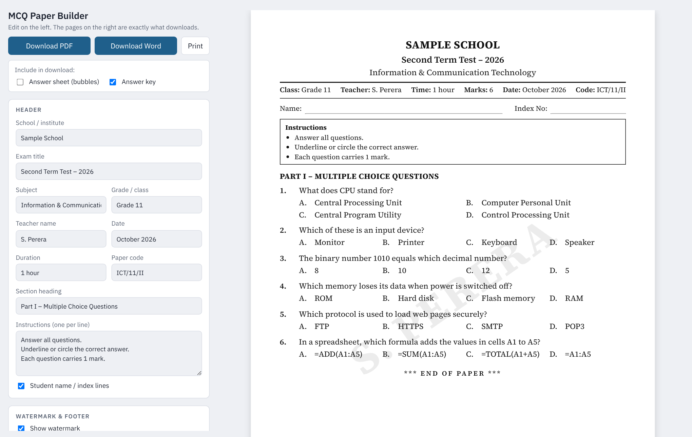

# MCQ Paper Builder

Make a clean, print-ready multiple choice question paper in a few minutes, then download it as **PDF** or **Word (.docx)**.

Built for school teachers and tuition class teachers in Sri Lanka. Sinhala, English and Tamil all display correctly.



---

## Features

**Paper header**
- School or institute name, exam title, subject, grade, teacher name, date, duration and paper code
- Your own section heading and instructions (one per line)
- Optional name and index number lines for students
- Total marks are added up automatically

**Watermark and footer**
- Diagonal watermark on every page, using the teacher name or any text you choose
- Adjustable darkness, angle and size
- Footer on every page with teacher name, subject, your own centre text and "Page X of Y"

**Questions**
- Add, edit, delete, move up or down, and shuffle questions
- 2 to 6 options per question, with marks per question
- Click a letter to set the correct answer
- Bulk paste many questions at once (format below)

**Layout**
- 1, 2 or 4 options per row, or automatic based on option length
- Option labels as `A. B. C.`, `(a) (b) (c)`, `(1) (2) (3)` or `(i) (ii) (iii)`
- One or two page columns
- Small, normal or large text
- Real A4 pages in the preview. Questions are never split across two pages

**Extra pages** (tick before downloading)
- Bubble answer sheet for students
- Answer key table for the teacher
- Teacher copy with correct answers underlined on the paper

**Downloads**
- **PDF**: matches the preview exactly
- **Word (.docx)**: fully editable, with the watermark behind the text and automatic page numbers in the footer
- **Print**: prints straight from the browser without the browser's date, title or URL on the page

**Saving**
- Work saves automatically in your browser
- Export a paper to a `.json` file and import it again later or on another computer

---

## Getting started

No install, no build step. It is a single HTML file.

1. Download `mcq-paper-builder.html`
2. Open it in **Chrome** or **Edge**
3. Fill in the header, add your questions, and click **Download PDF** or **Download Word**

An internet connection is needed the first time you download in each session, because the PDF and Word libraries load from a CDN.

### Host it on GitHub Pages

1. Rename `mcq-paper-builder.html` to `index.html`
2. Push it to your repository
3. Go to **Settings → Pages**, choose your branch and the root folder, and save
4. Your app will be live at `https://<your-username>.github.io/<repo-name>/`

---

## Bulk paste format

Paste questions into the **Bulk paste** box like this:

```
1. What does CPU stand for?
A) Central Processing Unit  B) Computer Personal Unit  C) Central Program Utility  D) Control Processing Unit
Answer: A

2. Which of these is an input device?
A) Monitor
B) Printer
C) Keyboard
D) Speaker
Answer: C
```

- Options can be on one line or on separate lines
- `A)`, `A.` and `(A)` all work
- The `Answer:` line is optional. Without it, option A is marked as correct

---

## Built with

| Part | Library |
| --- | --- |
| PDF export | [jsPDF](https://github.com/parallax/jsPDF) 2.5.1 and [html2canvas](https://github.com/niklasvh/html2canvas) 1.4.1 |
| Word export | [docx](https://github.com/dolanmiu/docx) 8.5.0 |
| Fonts | Source Serif 4, IBM Plex Sans, Noto Sans Sinhala and Noto Sans Tamil from Google Fonts |

Everything else is plain HTML, CSS and JavaScript with no framework.

---

## Notes

- The PDF is made from images of each page, so its text cannot be selected or edited. Use the Word download when you want to make changes later.
- Saved work lives in the browser you used. Clearing browser data removes it, so export important papers to a `.json` file.
- In Word, Sinhala text uses the Iskoola Pota font, which comes with Windows.

---

## Contributing

Issues and pull requests are welcome. If you find a layout problem, please include a screenshot and the exported `.json` file of your paper.

## License

Released under the [MIT License](LICENSE).
